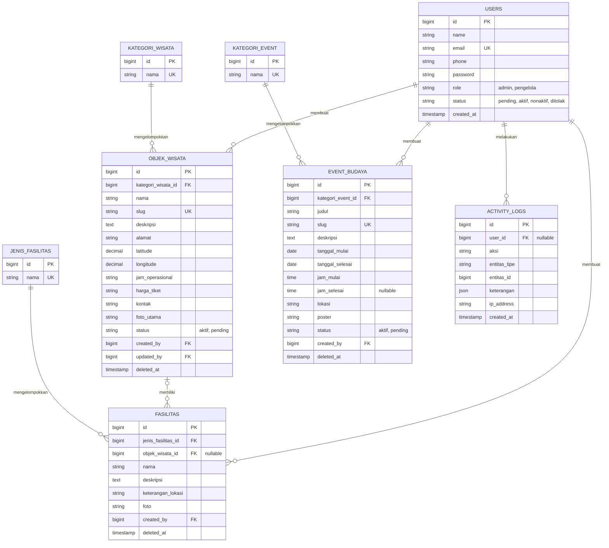

# PRD — Sistem Informasi Manajemen Desa Wisata Kampung Gedung Batin

Berbasis **Location Based Services (LBS)** dan **Kalender Event Budaya Digital**

| Item | Keterangan |
|---|---|
| Versi / Status | 0.1 — Draft untuk ditinjau |
| Tanggal | 21 September 2026 |
| Penyusun | O'os Syawal Syah Putra (2271020207), Prodi Sistem Informasi, UIN Raden Intan Lampung |
| Sumber | Proposal Skripsi "Perancangan Sistem Informasi Manajemen Desa Wisata Kampung Gedung Batin dengan LBS dan Kalender Event Budaya" (Bab I–III) |
| Target hasil | **Sistem berjalan penuh dan di-deploy** untuk dipakai nyata oleh pengelola dan wisatawan |
| Cakupan fitur | **Persis proposal** (sesuai Use Case Diagram, Gambar 3.1), ditambah fungsi pendukung minimal agar use case dapat berjalan |
| Stack | Laravel + MySQL + Leaflet/OpenStreetMap |

**Legenda.** Prioritas memakai MoSCoW: **Must** (wajib untuk rilis), **Should** (diupayakan), **Could** (jika waktu ada). Kolom *Sumber*: **UC** berarti langsung dari use case/diagram proposal; **PD** berarti pendukung, yaitu dibutuhkan agar UC berjalan dan bukan fitur baru.

---

## 1. Ringkasan Produk

### 1.1 Latar Belakang dan Masalah

Kampung Gedung Batin (Kabupaten Way Kanan, Lampung) memiliki rumah adat tradisional dan kegiatan budaya yang masih dilestarikan, tetapi pengelolaan informasinya masih sederhana:

- Informasi lokasi, fasilitas, akses, dan jadwal kegiatan budaya tersebar di media sosial dan komunikasi langsung dengan pengelola.
- Belum ada website/aplikasi dan belum ada navigasi digital menuju lokasi wisata.
- Jadwal event budaya sering terlambat diketahui wisatawan.
- Kunjungan relatif rendah: sekitar 5–15 orang/hari pada hari biasa dan 20–50 orang/hari pada akhir pekan; lonjakan hanya terjadi saat event (data wawancara pengelola, dipakai sebagai *baseline*).

### 1.2 Tujuan Produk

1. Menyediakan **satu website terintegrasi** yang menampilkan objek wisata, fasilitas pendukung, peta lokasi, dan kalender event budaya Kampung Gedung Batin.
2. Membantu wisatawan **menemukan dan menuju lokasi wisata** dengan LBS (wisata terdekat dari posisi pengguna dan navigasi sederhana).
3. Memudahkan pengelola **mengelola dan memperbarui informasi** (objek wisata, fasilitas, event) tanpa bantuan teknis.

### 1.3 Indikator Keberhasilan

| # | Indikator | Target |
|---|---|---|
| K1 | Seluruh skenario black box untuk requirement **Must** | 100% lulus; tidak ada bug *critical/major* terbuka |
| K2 | Skor **System Usability Scale (SUS)** rata-rata | ≥ 68 (rata-rata industri) |
| K3 | UAT pengelola: menambah 1 objek wisata + 1 event + 1 fasilitas secara mandiri | Berhasil tanpa bantuan developer |
| K4 | Sistem *live* di domain ber-HTTPS dengan konten awal terisi (semua objek wisata aktif dan kalender event tahun berjalan menurut pengelola) | Tercapai sebelum serah terima |
| K5 | Perubahan data oleh pengelola tampil di halaman publik | ≤ 60 detik |

> Peningkatan jumlah kunjungan adalah tujuan jangka panjang proyek, tetapi **tidak diukur oleh sistem ini** karena statistik kunjungan berada di luar cakupan (lihat bagian 2). Angka *baseline* pada 1.1 dapat dibandingkan secara manual oleh pengelola setelah beberapa bulan operasi.

---

## 2. Ruang Lingkup

### 2.1 Dalam Lingkup (In Scope)

- Website responsif dengan tiga peran: **Admin**, **Pengelola Wisata**, **Wisatawan**.
- Autentikasi dan otorisasi berbasis peran untuk Admin dan Pengelola. Wisatawan **tanpa akun**.
- Admin: kelola data master, kelola akun pengguna, verifikasi pengelola, lihat log aktivitas.
- Pengelola: CRUD objek wisata, CRUD fasilitas, CRUD event budaya.
- Wisatawan: lihat informasi wisata, cari lokasi wisata (LBS), lihat detail wisata, lihat peta wisata, lihat kalender event budaya, lihat detail event.
- LBS terbatas pada **pencarian lokasi wisata dan navigasi sederhana berbasis lokasi pengguna** (Batasan Masalah no. 2).
- Dashboard ringkasan untuk Admin dan Pengelola (sesuai rancangan antarmuka).
- Pengujian (black box, UAT, SUS), **deployment ke server produksi**, pelatihan, dan serah terima (Batasan Masalah no. 3).

### 2.2 Di Luar Lingkup (Out of Scope)

Tidak dikerjakan pada rilis ini agar tetap setia pada proposal:

- Pencarian event berdasarkan lokasi pengguna, dan penandaan event pada peta.
- Statistik/pemantauan kunjungan wisatawan dan dashboard analitik.
- Menu **Berita** (muncul pada mockup Gambar 3.4, tetapi tidak ada di use case).
- Registrasi/akun wisatawan, ulasan, rating, reservasi, pembayaran, pemesanan tiket.
- Rute turn-by-turn di dalam aplikasi (navigasi memakai aplikasi peta eksternal, lihat LBS-05).
- Aplikasi mobile native, mode offline/PWA, multi-bahasa, notifikasi push.
- Rekomendasi/personalisasi (mis. content-based filtering) dan integrasi media sosial otomatis.

---

## 3. Pengguna dan Hak Akses

| Peran | Deskripsi | Autentikasi |
|---|---|---|
| **Wisatawan** | Calon/pengunjung wisata; mengakses informasi, peta, LBS, dan kalender lewat ponsel maupun desktop. | Tidak perlu login |
| **Pengelola Wisata** | Pengelola desa wisata yang memelihara konten (objek wisata, fasilitas, event). Akun harus diverifikasi Admin. | Email + password |
| **Admin** | Pengelola sistem: data master, akun, verifikasi pengelola, memantau log. | Email + password |

| Kemampuan | Wisatawan | Pengelola | Admin |
|---|:-:|:-:|:-:|
| Melihat halaman publik (wisata, peta, LBS, kalender) | Ya | Ya | Ya |
| CRUD objek wisata, fasilitas, event budaya | — | Ya | — |
| Kelola data master | — | — | Ya |
| Kelola akun pengguna & verifikasi pengelola | — | — | Ya |
| Lihat log aktivitas | — | — | Ya |
| Dashboard | — | Dashboard Pengelola | Dashboard Admin |

Keputusan desain: karena sistem melayani **satu desa**, seluruh Pengelola berbagi data yang sama (tidak ada pemisahan data per pengelola). Siapa yang mengubah apa dicatat di log aktivitas.

---

## 4. Definisi Istilah

| Istilah | Definisi dalam PRD ini |
|---|---|
| Real-time | (a) **Data konten**: perubahan pengelola tampil ke wisatawan tanpa langkah publikasi manual, maksimal 60 detik. (b) **Posisi pengguna**: diambil dari perangkat saat pengguna meminta dan dapat diperbarui kapan saja. Bukan *live streaming*. |
| Wisata terdekat | Daftar objek wisata aktif yang diurutkan berdasarkan **jarak garis lurus** (Haversine) dari posisi pengguna. Bukan jarak tempuh jalan. |
| Status *Aktif* | Data tampil di halaman publik. |
| Status *Pending* | Data tersimpan tetapi belum ditayangkan (draf); tidak tampil di halaman publik. |
| Status event turunan | *Akan datang*, *Berlangsung*, *Selesai*: dihitung otomatis dari tanggal (zona waktu WIB), bukan diinput manual. |
| Data master | Daftar referensi: kategori wisata, kategori event, jenis fasilitas (lihat A2 pada bagian 15). |

---

## 5. Kebutuhan Fungsional

### 5.1 Autentikasi dan Akun (AUTH)

| ID | Kebutuhan dan kriteria penerimaan | Prioritas | Sumber |
|---|---|:-:|:-:|
| AUTH-01 | **Login** Admin/Pengelola dengan email + password; setelah berhasil diarahkan ke dashboard sesuai peran. Kredensial salah → pesan galat generik (tidak membocorkan email mana yang valid). | Must | UC |
| AUTH-02 | **Logout** mengakhiri sesi dan mengarahkan ke halaman publik. | Must | UC |
| AUTH-03 | Akun Pengelola berstatus `pending`, `ditolak`, atau `nonaktif` **tidak dapat login**; sistem menampilkan pesan status yang jelas. | Must | UC |
| AUTH-04 | **Kontrol akses berbasis peran**: rute `/admin/*` hanya untuk Admin, `/pengelola/*` hanya untuk Pengelola; akses tidak sah → 403; pengguna belum login → diarahkan ke login. | Must | UC |
| AUTH-05 | **Registrasi Pengelola** (nama, email, no. HP, password); akun dibuat berstatus `pending` menunggu verifikasi Admin (lihat A1). | Must | PD |
| AUTH-06 | Pengguna dapat mengubah password sendiri. Pembatasan percobaan login (maks. 5 kali/menit per IP+email). | Should | PD |
| AUTH-07 | Reset password via email (memerlukan SMTP). | Could | PD |

### 5.2 Fitur Admin (ADM)

| ID | Kebutuhan dan kriteria penerimaan | Prioritas | Sumber |
|---|---|:-:|:-:|
| ADM-01 | **Dashboard Admin**: jumlah objek wisata aktif, event aktif, pengelola aktif, pengelola menunggu verifikasi, dan daftar data wisata terbaru. | Must | UC |
| ADM-02 | **Kelola Data Master** (CRUD): kategori wisata, kategori event, jenis fasilitas. Data master yang masih dipakai **tidak dapat dihapus** (tampilkan pesan alasan). Nama unik. | Must | UC |
| ADM-03 | **Kelola Akun Pengguna**: daftar, tambah, ubah (nama, email, peran, status), reset password oleh Admin, nonaktifkan. Admin tidak dapat menonaktifkan/menurunkan dirinya sendiri, dan minimal satu Admin aktif harus selalu ada. | Must | UC |
| ADM-04 | **Verifikasi Pengelola**: daftar akun `pending`; Admin dapat **menyetujui** (→ `aktif`) atau **menolak** (→ `ditolak`, alasan opsional). Aksi tercatat di log. | Must | UC |
| ADM-05 | **Lihat Log Aktivitas** (baca-saja): waktu, pengguna, aksi, entitas, IP; terurut terbaru, berpaginasi. Filter berdasarkan pengguna dan rentang tanggal. | Must (filter: Should) | UC |
| ADM-06 | Akun Admin awal dibuat lewat *seeder* (kredensial dari `.env`), dan wajib mengganti password pada login pertama. | Should | PD |

### 5.3 Objek Wisata (WIS) — Pengelola

| ID | Kebutuhan dan kriteria penerimaan | Prioritas | Sumber |
|---|---|:-:|:-:|
| WIS-01 | **Tambah** objek wisata dengan field: nama, kategori, deskripsi, alamat, **koordinat (latitude, longitude)**, jam operasional, harga tiket/keterangan, kontak, foto utama, status (*Aktif*/*Pending*). Data valid tersimpan; slug URL dibuat otomatis dan unik. | Must | UC |
| WIS-02 | **Ubah** objek wisata (semua field pada WIS-01). Perubahan tercatat di log. | Must | UC |
| WIS-03 | **Hapus** objek wisata dengan dialog konfirmasi. Memakai *soft delete* (dapat dipulihkan oleh developer/Admin lewat database). Fasilitas terkait tidak ikut terhapus (menjadi fasilitas umum). | Must | UC |
| WIS-04 | **Daftar** objek wisata (tabel: No, Nama, Kategori, Koordinat, Status, Aksi Edit/Hapus) dengan pencarian nama dan paginasi. | Must | UC |
| WIS-05 | **Pemilih koordinat pada peta** (Leaflet): klik/geser marker mengisi latitude & longitude; input manual tetap tersedia. Validasi: lat −90…90, lng −180…180, wajib diisi. | Must | PD |
| WIS-06 | Unggah foto: JPG/PNG/WebP, maks. 2 MB; otomatis di-*resize* dan dibuat *thumbnail*. | Must | PD |
| WIS-07 | Galeri foto tambahan (maks. 5 per objek). | Should | PD |

### 5.4 Fasilitas (FAS) — Pengelola

| ID | Kebutuhan dan kriteria penerimaan | Prioritas | Sumber |
|---|---|:-:|:-:|
| FAS-01 | **Tambah** fasilitas pendukung: nama, jenis fasilitas (data master), deskripsi, keterangan lokasi, foto (opsional), **objek wisata terkait (opsional)**. Fasilitas tanpa objek wisata dianggap fasilitas umum desa. | Must | UC |
| FAS-02 | **Ubah** fasilitas. | Must | UC |
| FAS-03 | **Hapus** fasilitas (konfirmasi, *soft delete*). | Must | UC |
| FAS-04 | Daftar fasilitas dengan pencarian dan filter jenis. | Must | PD |
| FAS-05 | Fasilitas ditampilkan pada halaman Detail Wisata (yang terkait) dan pada halaman Informasi Wisata (fasilitas umum). | Must | UC |

### 5.5 Event Budaya (EVT) — Pengelola

| ID | Kebutuhan dan kriteria penerimaan | Prioritas | Sumber |
|---|---|:-:|:-:|
| EVT-01 | **Tambah** event: judul, kategori event (data master), deskripsi, tanggal mulai, tanggal selesai, jam mulai, jam selesai (opsional), lokasi (teks), poster (opsional), status (*Aktif*/*Pending*). | Must | UC |
| EVT-02 | **Ubah** event. | Must | UC |
| EVT-03 | **Hapus** event (konfirmasi, *soft delete*). | Must | UC |
| EVT-04 | **Daftar** event (terbaru di atas) dengan pencarian, filter status turunan (Akan datang/Berlangsung/Selesai), dan paginasi. | Must | PD |
| EVT-05 | Validasi: tanggal selesai ≥ tanggal mulai; judul, tanggal mulai, dan lokasi wajib. Event multi-hari didukung. | Must | PD |

### 5.6 Halaman Publik — Wisatawan (PUB)

| ID | Kebutuhan dan kriteria penerimaan | Prioritas | Sumber |
|---|---|:-:|:-:|
| PUB-01 | **Beranda**: pengantar singkat desa wisata, sorotan objek wisata, daftar 3–5 event mendatang, dan pintasan ke Peta/Cari Lokasi/Kalender. | Must | UC |
| PUB-02 | **Lihat Informasi Wisata**: daftar objek wisata *Aktif* (kartu: foto, nama, kategori, ringkasan) + bagian fasilitas umum. Filter kategori dan pencarian nama. | Must (filter: Should) | UC |
| PUB-03 | **Lihat Detail Wisata**: foto, deskripsi, alamat, jam operasional, harga, kontak, fasilitas terkait, mini-peta, dan tombol **Navigasi**. Objek berstatus *Pending* atau terhapus → 404. | Must | UC |
| PUB-04 | **Lihat Peta Wisata**: peta Leaflet dengan marker seluruh objek *Aktif*; peta otomatis menyesuaikan batas marker; klik marker → popup (foto kecil, nama, tautan ke detail). | Must | UC |
| PUB-05 | **Lihat Kalender Event Budaya**: lihat bagian 6.2. | Must | UC |
| PUB-06 | **Lihat Detail Event**: judul, poster, tanggal & waktu, lokasi, kategori, deskripsi, label status turunan. | Must | UC |
| PUB-07 | Halaman publik tidak memerlukan login dan dapat diakses di ponsel (320 px) hingga desktop. | Must | UC |
| PUB-08 | Tag *meta* Open Graph/Twitter Card dan judul/deskripsi halaman, agar tautan yang dibagikan di WhatsApp/media sosial tampil dengan pratinjau (mendukung tujuan promosi). | Should | PD |
| PUB-09 | Tombol bagikan (salin tautan / WhatsApp) pada detail wisata dan detail event. | Could | PD |

### 5.7 Location Based Services (LBS)

| ID | Kebutuhan dan kriteria penerimaan | Prioritas | Sumber |
|---|---|:-:|:-:|
| LBS-01 | **Cari Lokasi Wisata**: halaman Peta/LBS memiliki kotak pencarian nama wisata dan tombol **"Cari Wisata Terdekat"**. Menekan tombol memicu permintaan izin lokasi browser (Geolocation API, akurasi tinggi, *timeout* ±10 detik). Izin **hanya diminta setelah tombol ditekan**, bukan saat halaman dibuka. | Must | UC |
| LBS-02 | **Deteksi lokasi berhasil**: peta menampilkan penanda posisi pengguna (+ lingkaran akurasi) dan seluruh objek wisata; sistem menampilkan **daftar wisata terdekat** terurut jarak (Haversine), format "850 m" atau "3,4 km", dengan label *jarak garis lurus*. | Must | UC |
| LBS-03 | Memilih objek dari daftar/marker menampilkan kartu ringkas: nama, jarak, tombol **Navigasi**, dan tautan **Detail**. | Must | UC |
| LBS-04 | **Penanganan galat** (izin ditolak, GPS/posisi tidak tersedia, timeout, browser tidak mendukung): tampilkan pesan ramah berbahasa Indonesia + cara mengaktifkan izin, dan **tetap tampilkan peta dan daftar wisata tanpa jarak** (fallback). | Must | PD |
| LBS-05 | **Navigasi sederhana**: tombol Navigasi membuka aplikasi/situs peta eksternal dengan tujuan koordinat objek, memakai *deep link* tanpa API key (mis. `https://www.google.com/maps/dir/?api=1&destination={lat},{lng}`); posisi awal = lokasi pengguna saat ini (lihat A3). | Must | UC |
| LBS-06 | **Privasi**: koordinat pengguna diproses **di browser saja** dan tidak dikirim ke server atau disimpan. Halaman menampilkan keterangan singkat kegunaan izin lokasi. | Must | PD |
| LBS-07 | Tombol **"Perbarui lokasi"** untuk mengambil ulang posisi dan menghitung ulang jarak. | Must | UC |
| LBS-08 | Pembaruan posisi otomatis (`watchPosition`) dengan *throttling*, dapat dimatikan pengguna. | Could | UC |

### 5.8 Pencatatan Aktivitas (LOG) — lintas modul

| ID | Kebutuhan dan kriteria penerimaan | Prioritas | Sumber |
|---|---|:-:|:-:|
| LOG-01 | Sistem otomatis mencatat: login (berhasil/gagal), logout, tambah/ubah/hapus objek wisata, fasilitas, event, data master, akun pengguna, dan keputusan verifikasi. Setiap catatan menyimpan pengguna, aksi, entitas (tipe + id), ringkasan perubahan, IP, dan waktu. Log tidak dapat diubah/dihapus lewat antarmuka. | Must | UC |

---

## 6. Spesifikasi Detail

### 6.1 Alur LBS (Wisatawan)

```
Buka halaman Peta/LBS
  → peta + semua marker tampil (tanpa meminta lokasi)
  → pengguna menekan "Cari Wisata Terdekat"
      → browser meminta izin lokasi
          ├─ diizinkan → ambil koordinat → hitung jarak Haversine (di browser)
          │              → tampilkan posisi pengguna + daftar terdekat
          │              → pilih objek → kartu ringkas → "Navigasi" (buka peta eksternal)
          └─ ditolak / tidak tersedia / timeout
                         → pesan galat + fallback: daftar & peta tanpa jarak
```

Catatan teknis:

- Geolocation API di browser modern hanya berfungsi pada **konteks aman (HTTPS)** sehingga HTTPS wajib di produksi (juga `localhost` saat pengembangan).
- Data objek wisata untuk peta/LBS disajikan oleh endpoint read-only berformat GeoJSON/JSON (`/api/wisata`) berisi hanya objek *Aktif*. Karena jumlah objek kecil (puluhan), penghitungan jarak dan pengurutan dilakukan di klien. Ini lebih sederhana dan menjaga privasi lokasi pengguna. Jika data tumbuh besar, dapat dipindah ke server tanpa mengubah kebutuhan.
- Rumus Haversine dengan jari-jari bumi 6.371 km; hasil dibulatkan (meter < 1 km, 1 desimal untuk km).

### 6.2 Kalender Event Budaya

- **Tampilan bulanan** (grid 7 kolom) dengan penanda pada tanggal yang memiliki event; navigasi bulan sebelumnya/berikutnya dan tombol "Hari ini".
- Klik tanggal → panel daftar event pada tanggal tersebut; tanpa pilihan tanggal, panel menampilkan event pada bulan yang sedang dilihat.
- **Event multi-hari** muncul pada setiap hari dalam rentang tanggalnya.
- Hanya event berstatus *Aktif* dan tidak terhapus yang tampil.
- Setiap event menampilkan label status turunan (*Akan datang*, *Berlangsung*, *Selesai*) berdasarkan tanggal WIB.
- Klik event → halaman Detail Event.
- Bulan tanpa event menampilkan pesan kosong yang informatif ("Belum ada event pada bulan ini").
- Implementasi tampilan kalender (pustaka siap pakai seperti FullCalendar atau komponen kustom) diputuskan pada fase prototype, dengan syarat responsif dan berbahasa Indonesia.

---

## 7. Model Data



Ketentuan data:

- `latitude`/`longitude`: `DECIMAL(10,7)` (presisi sekitar 1 cm), wajib untuk `OBJEK_WISATA`.
- Seluruh string berkode `utf8mb4`; zona waktu aplikasi `Asia/Jakarta` (WIB).
- *Soft delete* (`deleted_at`) pada objek wisata, fasilitas, dan event. Data master dan akun tidak dihapus permanen jika masih direferensikan.
- Tabel galeri (`GALERI_WISATA`) ditambahkan hanya jika WIS-07 dikerjakan.
- Password disimpan sebagai *hash* (bcrypt/argon2 bawaan Laravel).

---

## 8. Antarmuka dan Navigasi

### 8.1 Peta Halaman

Merujuk mockup pada proposal (Gambar 3.4) dan Activity Diagram (Gambar 3.2).

| Area | URL | Halaman | Peran |
|---|---|---|---|
| Publik | `/` | Beranda | Semua |
| | `/wisata` | Informasi Wisata (daftar + fasilitas umum) | Semua |
| | `/wisata/{slug}` | Detail Wisata | Semua |
| | `/peta` | Peta Wisata + Cari Lokasi (LBS) | Semua |
| | `/kalender` | Kalender Event Budaya | Semua |
| | `/event/{slug}` | Detail Event | Semua |
| Akun | `/login`, `/logout` | Login/Logout | Admin, Pengelola |
| | `/daftar-pengelola` | Registrasi Pengelola | Calon Pengelola |
| Admin | `/admin` | Dashboard Admin | Admin |
| | `/admin/master/*` | Kelola Data Master | Admin |
| | `/admin/pengguna` | Kelola Akun Pengguna | Admin |
| | `/admin/verifikasi` | Verifikasi Pengelola | Admin |
| | `/admin/log` | Log Aktivitas | Admin |
| Pengelola | `/pengelola` | Dashboard Pengelola | Pengelola |
| | `/pengelola/wisata`, `/fasilitas`, `/event` | Kelola Data (tabel + form) | Pengelola |
| API | `/api/wisata` | GeoJSON objek wisata aktif (read-only) | Publik |

### 8.2 Prinsip Antarmuka

- **Mobile-first**: sebagian besar wisatawan mengakses lewat ponsel di lapangan. Target sentuh ≥ 44 px, teks minimum 16 px, peta memenuhi lebar layar.
- Bahasa antarmuka **Bahasa Indonesia**; format tanggal Indonesia (mis. "8 Mei 2026") dan waktu "19.00 WIB".
- Panel Admin/Pengelola: sidebar + tabel data dengan tombol *Edit* (biru) dan *Hapus* (merah) serta tombol "+ Tambah" (mengikuti mockup).
- Setiap aksi hapus memerlukan konfirmasi; setiap form menampilkan validasi per field dalam bahasa Indonesia.
- Sidebar Pengelola: **Data Wisata, Fasilitas, Event Budaya** (menu "Berita" pada mockup tidak dimasukkan, lihat A4).
- Wireframe/UI final dihasilkan pada fase prototype dan dievaluasi bersama pengelola sebelum dikembangkan.

---

## 9. Kebutuhan Non-Fungsional

| ID | Kategori | Kebutuhan |
|---|---|---|
| NFR-01 | Kompatibilitas | Dua versi terakhir Chrome, Firefox, Edge, Safari (desktop), serta Chrome Android dan Safari iOS. Tata letak responsif 320–1440 px. |
| NFR-02 | Kinerja | Halaman publik memuat konten utama ≤ 3 detik pada jaringan seluler 4G; respons server median ≤ 500 ms pada beban normal. Gambar dikompres, *lazy-loading*, dan tile peta hanya dimuat saat dibutuhkan. Jaringan di desa bisa lemah sehingga halaman harus ringan. |
| NFR-03 | Keamanan | HTTPS wajib; proteksi CSRF; *escaping* output (XSS); kueri berparameter/Eloquent (SQL injection); RBAC di *middleware/policy*; validasi & sanitasi unggahan (tipe MIME, ekstensi, ukuran); pembatasan laju login; *cookie* sesi `Secure`/`HttpOnly`/`SameSite`; `APP_DEBUG=false` dan `.env` di luar *web root* pada produksi. |
| NFR-04 | Privasi | Lokasi wisatawan tidak disimpan (LBS-06). Data pribadi hanya milik akun Admin/Pengelola (nama, email, no. HP), diakses sebatas kebutuhan pengelolaan sistem, sejalan dengan UU No. 27 Tahun 2022 tentang Pelindungan Data Pribadi. Halaman kebijakan privasi singkat di *footer* (Should). |
| NFR-05 | Ketersediaan & pencadangan | Target uptime ≥ 99%/bulan (bergantung penyedia hosting). Cadangan otomatis harian untuk database dan folder unggahan, retensi ≥ 14 hari, salinan disimpan di lokasi terpisah dari server; **uji pemulihan minimal sekali sebelum go-live**. |
| NFR-06 | Usability | SUS ≥ 68; tugas inti wisatawan ("cari wisata terdekat" dan "lihat event bulan ini") dicapai dalam ≤ 3 ketukan/klik dari Beranda. |
| NFR-07 | Aksesibilitas dasar | Kontras warna memadai, teks alternatif gambar, label pada semua input, navigasi keyboard dasar di panel Admin/Pengelola. |
| NFR-08 | Kemudahan pemeliharaan | Kode di Git; *migration* dan *seeder*; standar gaya kode PSR-12 (mis. Laravel Pint); README instalasi; konfigurasi lewat `.env`. |
| NFR-09 | Atribusi & kebijakan peta | Peta menampilkan atribusi "© OpenStreetMap contributors" dan mematuhi kebijakan penggunaan tile OpenStreetMap. Trafik desa ini kecil, tetapi bila melonjak, ganti ke penyedia tile lain atau host sendiri. |
| NFR-10 | Lokalisasi | Zona waktu WIB (`Asia/Jakarta`), bahasa Indonesia, format tanggal/angka Indonesia. |

---

## 10. Arsitektur dan Tech Stack

Arsitektur: **aplikasi monolit MVC** (Laravel) dengan tampilan sisi-server (Blade) dan sedikit JavaScript untuk peta, LBS, dan kalender.

| Lapisan | Pilihan | Catatan |
|---|---|---|
| Backend | **Laravel** (versi stabil terbaru + PHP yang didukungnya saat proyek dimulai) | Kunci versi di `composer.lock`. Eloquent ORM, Form Request untuk validasi, Policy/Gate untuk otorisasi. |
| Database | **MySQL 8** (`utf8mb4`) | MariaDB dapat dipakai bila hosting hanya menyediakan itu. |
| Frontend | Blade + **Tailwind CSS** (Vite); Alpine.js untuk interaksi ringan | Mobile-first. |
| Peta & LBS | **Leaflet** + tile **OpenStreetMap**; Geolocation API browser; Haversine di JS | Tanpa API key. |
| Kalender | FullCalendar atau komponen kustom | Diputuskan saat prototype. |
| Autentikasi | Auth bawaan Laravel (mis. starter kit Breeze) + kolom `role` dan `status` | Hanya 2 peran ber-login, jadi paket RBAC tambahan tidak diperlukan. |
| Penyimpanan berkas | Laravel Storage (disk `public`) + pemrosesan gambar (mis. Intervention Image) | Resize dan thumbnail saat unggah. |
| Log aktivitas | Model *observer* atau paket *activity-log* | Lihat LOG-01. |
| Pengujian otomatis | PHPUnit/Pest (*feature test* untuk RBAC, CRUD, validasi) | Melengkapi black box manual. |
| Versi kode | Git (repositori privat) | Cabang `main` = produksi. |

Prinsip: gunakan fitur standar Laravel sebelum menambah paket; tidak memakai layanan berbayar/API key pada rilis ini.

---

## 11. Pengujian dan Kriteria Penerimaan

### 11.1 Black Box Testing (fungsional)

Setiap requirement **Must** minimal memiliki satu skenario uji positif dan satu negatif. Contoh cakupan:

| Modul | Skenario minimal |
|---|---|
| AUTH | Login valid/invalid; akun `pending`/`ditolak`/`nonaktif` ditolak; akses `/admin` oleh Pengelola → 403; akses tanpa login → redirect; logout. |
| ADM | Verifikasi (setuju/tolak) mengubah kemampuan login; master yang dipakai tidak bisa dihapus; Admin tidak bisa menonaktifkan dirinya; log tercatat untuk tiap aksi. |
| WIS/FAS/EVT | Tambah/ubah/hapus dengan data valid; validasi: field wajib kosong, koordinat di luar rentang, foto > 2 MB atau tipe salah, tanggal selesai < mulai; status *Pending* tidak tampil di publik; setelah hapus, data hilang dari publik. |
| PUB | Semua halaman publik terbuka tanpa login; detail wisata tidak ada → 404; marker peta = jumlah objek *Aktif*. |
| LBS | Izin diizinkan (jarak dan urutan benar dibanding perhitungan manual), izin ditolak (fallback), timeout, "Perbarui lokasi", tombol Navigasi membuka tujuan yang benar. Diuji di HP nyata (Android + iOS) pada HTTPS. |
| Kalender | Event satu hari dan multi-hari; pindah bulan; bulan kosong; label status turunan pada tanggal batas (hari mulai/selesai). |
| Lintas | Responsif (320/768/1280 px); perubahan pengelola muncul di publik ≤ 60 detik. |

Kriteria lulus: 100% skenario Must lulus; tidak ada cacat *critical/major* terbuka; cacat *minor* tercatat di daftar isu.

### 11.2 UAT dan SUS

- **UAT** dilakukan bersama Pengelola dengan skenario tugas nyata (K3).
- **SUS** memakai 10 pernyataan standar Brooke (1996), skala Likert 1–5. Skor: butir ganjil = (nilai − 1), butir genap = (5 − nilai), jumlah × 2,5 (rentang 0–100). Target rata-rata ≥ 68.
- Responden: seluruh Pengelola aktif + wisatawan/calon wisatawan (usulan **≥ 20 orang**, ditetapkan pada fase perencanaan pengujian; lihat A9). Responden mencoba sistem dengan daftar tugas sebelum mengisi kuesioner.

### 11.3 Definition of Done (per fitur)

Kode selesai dan ter-*review* → lulus uji otomatis terkait → lulus black box → responsif pada 3 ukuran layar → tercatat di log (bila mengubah data) → terdokumentasi di manual pengguna.

---

## 12. Deployment, Serah Terima, dan Pemeliharaan

Karena target adalah sistem yang **dipakai nyata**, bagian ini adalah bagian dari lingkup, bukan pelengkap.

### 12.1 Kebutuhan Lingkungan Produksi

- Hosting (VPS atau shared hosting yang mendukung Laravel: versi PHP sesuai, ekstensi `mbstring`, `openssl`, `pdo_mysql`, `fileinfo`, `gd`/`imagick`, akses Composer/SSH, *cron job*).
- MySQL/MariaDB, **domain**, dan **sertifikat HTTPS** (mis. Let's Encrypt, diperbarui otomatis).
- Lingkungan: *local* (pengembangan) dan *production*; *staging* opsional jika hosting memungkinkan.
- Pemantauan ketersediaan (mis. layanan *uptime monitor* gratis) dan log galat aplikasi.

### 12.2 Checklist Go-Live

- [ ] `APP_ENV=production`, `APP_DEBUG=false`, `APP_KEY` diatur, `.env` aman
- [ ] *Migration* dijalankan; *seeder* admin awal dan data master awal
- [ ] `storage:link`, izin folder benar, cache konfigurasi/rute aktif
- [ ] HTTPS aktif dan HTTP dialihkan ke HTTPS; Geolocation teruji di HP
- [ ] Cadangan otomatis berjalan dan **uji restore** berhasil
- [ ] Konten awal diinput (objek wisata dengan koordinat hasil survei lapangan, fasilitas, event tahun berjalan)
- [ ] Password Admin awal diganti; akun Pengelola dibuat/diverifikasi
- [ ] Atribusi OSM tampil; halaman diperiksa di Chrome Android dan Safari iOS

### 12.3 Serah Terima

- Dokumentasi: README instalasi/deploy, ERD, **manual pengguna** singkat bergambar untuk Admin dan Pengelola.
- **Pelatihan** Pengelola (±2–3 jam, praktik langsung: tambah wisata, fasilitas, event; ubah status).
- Serah terima akses (hosting, domain, database, repositori) kepada pemilik sistem yang ditunjuk (lihat A7).

### 12.4 Pemeliharaan

- Masa stabilisasi pasca-go-live ±2 minggu: perbaikan bug tanpa penambahan fitur.
- Setelahnya: pembaruan keamanan Laravel/PHP, pemantauan cadangan, dan pembaruan konten menjadi tanggung jawab pihak yang ditunjuk (A7). Perubahan fitur baru diproses sebagai permintaan terpisah (*change request*).

---

## 13. Rencana Pelaksanaan (Indikatif)

Metode pengembangan mengikuti **Prototype** (Bab III.C) dalam kerangka R&D. Durasi di bawah adalah estimasi awal ±10 minggu dan perlu disesuaikan dengan kalender akademik.

| Fase | Perkiraan | Kegiatan utama | Luaran |
|---|---|---|---|
| 1. Pengumpulan kebutuhan & konten | Minggu 1–2 | Wawancara/observasi lanjutan; survei koordinat GPS objek; kumpulkan foto, deskripsi, jadwal event | Kebutuhan final, konten awal |
| 2. Prototype & evaluasi | Minggu 2–3 | Wireframe/UI (login, dashboard, peta LBS, kalender, kelola data); evaluasi bersama pengelola | UI disetujui |
| 3. Fondasi | Minggu 3–4 | Repo, Laravel, migration/seeder, autentikasi, RBAC, layout dasar, log | Kerangka aplikasi |
| 4. Modul Admin & Pengelola | Minggu 4–6 | Data master, akun, verifikasi, CRUD wisata/fasilitas/event, unggah foto, map picker | Panel kelola lengkap |
| 5. Modul Publik, LBS, Kalender | Minggu 6–8 | Beranda, daftar/detail wisata, peta, LBS, kalender, detail event, GeoJSON | Situs publik lengkap |
| 6. Pengujian | Minggu 8–9 | Black box, uji otomatis, UAT, SUS, perbaikan | Laporan pengujian |
| 7. Deploy & serah terima | Minggu 10 | Setup hosting/domain/HTTPS, go-live checklist, pelatihan, dokumentasi | Sistem live + manual |

Bila waktu ketat, kerjakan lebih dulu semua **Must**; Should/Could dapat ditunda tanpa mengubah kesesuaian dengan proposal.

---

## 14. Risiko dan Mitigasi

| # | Risiko | Dampak | Mitigasi |
|---|---|---|---|
| R1 | Pengguna menolak izin lokasi atau sinyal GPS lemah | LBS tidak dapat dipakai | Izin hanya diminta setelah tombol ditekan; pesan jelas; fallback daftar & peta tanpa jarak (LBS-04) |
| R2 | Situs tanpa HTTPS | Geolocation diblokir browser | HTTPS wajib pada checklist go-live |
| R3 | Sinyal seluler lemah di desa | Halaman lambat | Gambar dikompres, lazy-loading, halaman ringan (NFR-02) |
| R4 | Koordinat objek wisata tidak akurat | Navigasi salah arah | Survei GPS di lokasi; map picker; verifikasi saat UAT |
| R5 | Konten tidak diperbarui pengelola (event basi) | Informasi menyesatkan, tujuan promosi gagal | Pelatihan; status event turunan otomatis "Selesai"; penunjukan penanggung jawab konten |
| R6 | Kebijakan/beban tile OSM | Peta terblokir atau lambat | Atribusi benar; trafik kecil; siapkan opsi penyedia tile alternatif (NFR-09) |
| R7 | Hosting/domain belum jelas siapa pemilik dan penanggung biayanya | Sistem tidak bisa dipakai nyata | Putuskan sebelum Fase 7 (A7) |
| R8 | *Scope creep* (Berita, statistik, event berbasis lokasi) | Jadwal molor, menyimpang dari proposal | Daftar Out of Scope; permintaan baru lewat change request |
| R9 | Waktu skripsi ketat karena mencakup pembangunan + pengujian + deploy | Target tidak tercapai | MoSCoW; prioritaskan Must; fase indikatif dijaga |
| R10 | Kehilangan data | Konten hilang | Cadangan otomatis + uji restore (NFR-05) |

---

## 15. Asumsi dan Pertanyaan Terbuka

PRD ini memakai asumsi berikut. Ubah bila tidak sesuai dan PRD akan diperbarui.

| # | Asumsi (default PRD) | Alasan | Perlu konfirmasi |
|---|---|---|---|
| A1 | Akun Pengelola dibuat lewat **registrasi mandiri**, lalu **diverifikasi Admin**. | Proposal memiliki use case "Verifikasi Pengelola" tetapi tidak ada "Registrasi". Alternatif: Admin yang membuat akun. | Ya |
| A2 | **Data Master** = kategori wisata, kategori event, jenis fasilitas. | Proposal tidak mendefinisikan isi "Kelola Data Master". Mockup menunjukkan kategori seperti Budaya, Alam, Agrowisata. | Ya |
| A3 | **Navigasi** = tombol yang membuka aplikasi peta eksternal (*deep link*), bukan rute di dalam aplikasi. | Sesuai batasan "navigasi sederhana"; tanpa API key/biaya. | Ya |
| A4 | Menu **Berita** pada mockup **tidak** dimasukkan. | Tidak ada di use case; jika diinginkan, jadikan fitur tambahan. | Ya |
| A5 | Status data hanya **Aktif/Pending**, mengikuti mockup. | Cukup untuk menyembunyikan draf. | Tidak |
| A6 | Antarmuka hanya **Bahasa Indonesia**. | Target pengguna lokal/nasional. | Tidak |
| A7 | **Siapa pemilik dan penanggung biaya hosting/domain, serta siapa pemelihara** setelah serah terima belum diketahui. | Krusial untuk "dipakai nyata" (R7). | **Ya, wajib** |
| A8 | Penghapusan memakai *soft delete*. | Aman dari salah hapus; mendukung jejak log. | Tidak |
| A9 | Jumlah responden SUS ≥ 20 dan komposisinya belum ditetapkan di proposal. | Proposal belum menyebut populasi/sampel. | Ya |
| A10 | Konten awal (foto, koordinat, deskripsi, jadwal event) disediakan/disurvei bersama pengelola. | Sistem tidak berguna tanpa konten. | Ya |
| A11 | Semua Pengelola berbagi data yang sama (tanpa pemisahan per pengelola) dan Admin tidak mengelola konten wisata. | Satu desa; sesuai pembagian peran pada use case. | Tidak |

**Catatan keselarasan dengan proposal.** Karena PRD ini menargetkan sistem yang di-deploy, dokumen proposal perlu diselaraskan: judul/rumusan/tujuan masih memakai kata "Perancangan", sedangkan Batasan Masalah no. 3, Bab III, dan manfaat praktis sudah menjanjikan implementasi penuh. Pertimbangkan judul "Rancang Bangun …" dan tambahan tujuan/evaluasi untuk deployment. Selain itu, Tujuan 2 ("efektivitas promosi dan pengelolaan") belum terukur oleh black box dan SUS; K3 (UAT pengelola) membantu menutup sebagian celah tersebut.

---

## 16. Keterlacakan ke Proposal

| Butir proposal | Dipenuhi oleh |
|---|---|
| Identifikasi Masalah 1 — belum ada sistem terintegrasi (objek, fasilitas, lokasi, jadwal) | PUB-01…04, FAS-05, LBS-01…07, WIS, FAS |
| Identifikasi Masalah 2 — pengelolaan info dan promosi masih sederhana | WIS, FAS, EVT (CRUD), ADM, PUB-08 (pratinjau berbagi tautan) |
| Identifikasi Masalah 3 — belum ada kalender event digital | EVT-01…05, PUB-05, PUB-06, bagian 6.2 |
| Batasan 1 — fokus objek wisata, fasilitas, lokasi, kalender event | Bagian 2.1 |
| Batasan 2 — LBS hanya pencarian lokasi dan navigasi sederhana | LBS-01…07, bagian 2.2 |
| Batasan 3 — analisis, perancangan, prototipe, pengujian, implementasi penuh | Bagian 11, 12, 13 |
| Tujuan 1 — merancang SIM berbasis LBS + kalender terintegrasi | Seluruh bagian 5 |
| Tujuan 2 — membantu pengelolaan dan promosi lebih efektif | Modul pengelola (5.3–5.5), PUB, K3 |
| Use case: Kelola Data Master / Akun / Verifikasi / Log | ADM-02 / ADM-03 / ADM-04 / ADM-05 |
| Use case: Kelola Data Objek Wisata / Event Budaya / Fasilitas | WIS-01…04 / EVT-01…03 / FAS-01…03 |
| Use case: Lihat Informasi Wisata, Cari Lokasi (LBS), Detail Wisata, Peta, Kalender, Detail Event | PUB-02 / LBS-01…03 / PUB-03 / PUB-04 / PUB-05 / PUB-06 |
| Use case: Login, Logout | AUTH-01, AUTH-02 |
| Evaluasi: Black Box + SUS | Bagian 11 |